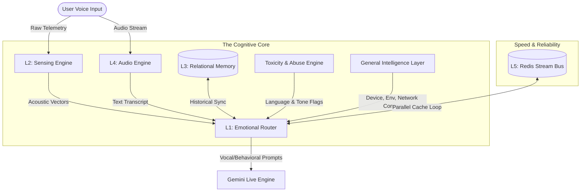
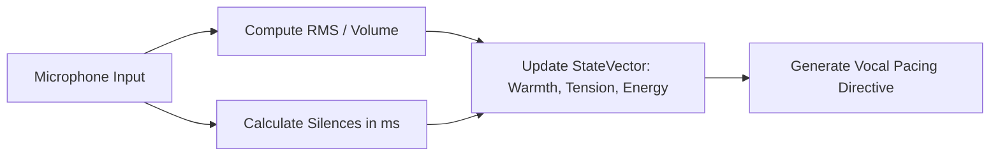
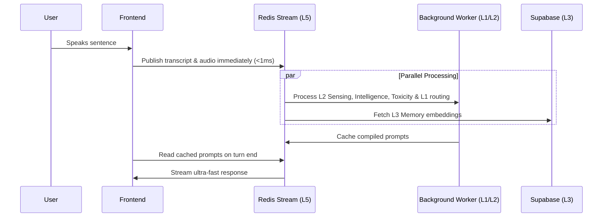

# **AURA: The Proactive Conversational Voice Companion**

AURA is an advanced voice companion engineered to bridge the gap between sterile AI interfaces and organic human presence. Rather than relying on simple text-in/text-out patterns, AURA is built upon a **parallel multi-brain cognitive architecture** that fuses real-time acoustic telemetry, dynamic emotional routing, and relational memory.

---

## 🎨 AURA vs. Standard Voice Bots: The Human Difference

To see how AURA stands out, contrast how a standard voice assistant and AURA handle the exact same human moment:

### The Scenario
A user comes home after a grueling 14-hour workday, speaking in a quiet, tired voice, pausing frequently.
> **User:** *(softly, pausing for 2 seconds)* "Hey... I'm just really overwhelmed with work today."

| Dimension | Standard Voice Assistant | AURA Voice Companion |
| :--- | :--- | :--- |
| **Vocal Reception** | Ignores volume and pacing; parses only the text transcript. | **Processes raw acoustic telemetry:** Measures the low volume (RMS 0.008) and the heavy 2-second initial pause. |
| **Cognitive Reaction** | Treats it as a standard query; searches for stress relief advice. | **Adapts conversational arc:** Detects a *withdrawing* emotional state and triggers a gentle, supportive prompt style. |
| **Contextual Memory** | Has no recollection of yesterday; starts the relationship from scratch. | **Enriches with relational memory:** Recalls that the user was preparing for a critical project launch this week. |
| **Vocal Delivery** | *Loud, energetic assistant voice:* "I understand you are overwhelmed! Here are 5 ways to manage work stress. First, prioritize your tasks..." | *Soft, quiet, slightly slowed voice:* "Oh... wahi launch na? Close your laptop, take a deep breath. We can catch up on this later, just relax right now, yaar." |

---

## 🧠 Inside AURA's "Five Brains"

AURA's processing power is distributed across five specialized "brains", now enhanced with **General Intelligence** and **Adaptive Toxicity** engines, operating in parallel to construct a natural, zero-latency response.



### 1. L1: Core Emotional Routing Engine (`backend.core.behavior`)
* **What it does:** Decides **how** to speak before deciding **what** to say.
* **How it works:** It acts as the traffic controller. It scans transcripts for psychological triggers (frustration, excitement, hesitation) and matches them to a curated behavior instruction set.

### 2. L2: Telemetry & Sensing Module (`backend.core.sensing`)
* **What it does:** Measures the human qualities of the voice—the sighs, the whispers, the speed.
* **How it works:**


### 3. L3: PGVector Relational Sync (`backend.memory.sync`)
* **What it does:** Acts as AURA's persistent long-term memory.
* **How it works:** Condenses key milestones into compressed emotional "seeds" at the end of every session, matched via semantic similarity searches using Supabase PGVector and ChromaDB.

### 4. L4: High-Fidelity Audio Engine (`src.providers.sarvam`)
* **What it does:** Converts speech to text and back to audio with extreme clarity.
* **How it works:** Optimized REST-based pipeline using Sarvam’s state-of-the-art **`bulbul:v3`** voices and **`saaras:v3`** model. Supports **barge-in monitoring** and seamless code-mixed **Hinglish**.

### 5. L5: Parallel Async Bus (`backend.bus.redis`)
* **What it does:** Handles the raw processing power and guarantees sub-200ms latency.
* **How it works:**


---

## 🌟 Latest Enhancements

### General Intelligence Layer
AURA is now grounded in reality through real-world context retrieval:
- **Device & Network Engine:** Detects connection strength, battery, and input capabilities.
- **Environment & Time Engine:** Adapts responses based on time of day (e.g., late-night whispers) and environmental acoustic factors.
- **Fallback Engine:** Gracefully manages degraded states (e.g., Redis offline, Supabase offline) to ensure unbroken conversation loops.

### Adaptive Toxicity & Abuse Engine
AURA organically handles hostility, profanity, and abuse across **Hindi (Devanagari)**, **Hinglish**, and **English**:
- **Multi-lingual Profanity Lexicon:** Covers 170+ abuse terms, utilizing **fuzzy matching (80%)** and **abbreviation expansion** (e.g., `bc`, `bsdk`).
- **Chaotic Personality Router:** Dynamically switches into *sarcastic roasts* or *aggressive chaotic banter* when high toxicity is detected.
- **Language Directives:** Adapts automatically without lecturing—if the user speaks in raw slang, AURA matches the tone perfectly.

---

## 🚀 Getting Started

### Prerequisites
- **Node.js** (v18+)
- **Python 3.12+** (compiled with development headers)
- **System Compilers:** `gcc`, `gcc-c++`, `make` (required to compile high-speed native Redis and database extensions)

### Fedora / RHEL Dependencies Setup
```bash
sudo dnf install gcc gcc-c++ make python3-devel
```

### Installation
```bash
# 1. Frontend Web App Setup
npm install

# 2. Backend virtual environment & python packages compilation
python3 -m venv venv
source venv/bin/activate
pip install -r requirements.txt
```

### Execution Vectors
* **Full-Flow CLI Pipeline Test:**
  ```bash
  venv/bin/python test_demo_flow.py
  ```
* **Start Backend API Server:**
  ```bash
  venv/bin/uvicorn backend.api.main:app --reload --port 8000
  ```
* **Start Vite Frontend App:**
  ```bash
  npm run dev
  ```

---

## ⚠️ Current Instabilities & Limitations

* **Fallback Database Latency (Redis/Supabase Circuit Breaker):** Under heavy offline failover conditions, database fallbacks use a circuit-breaker mode, which can slightly delay first-turn state vector injection.
* **Low-Bandwidth Microphones (8kHz):** Low-sample-rate audio streams require manual adjustment of front-end WebAudio nodes to avoid degraded telemetry extraction.
* **Browser Sandbox Limitations:** Advanced barge-in audio interruption is fully optimized primarily on Chromium-based browser environments.
