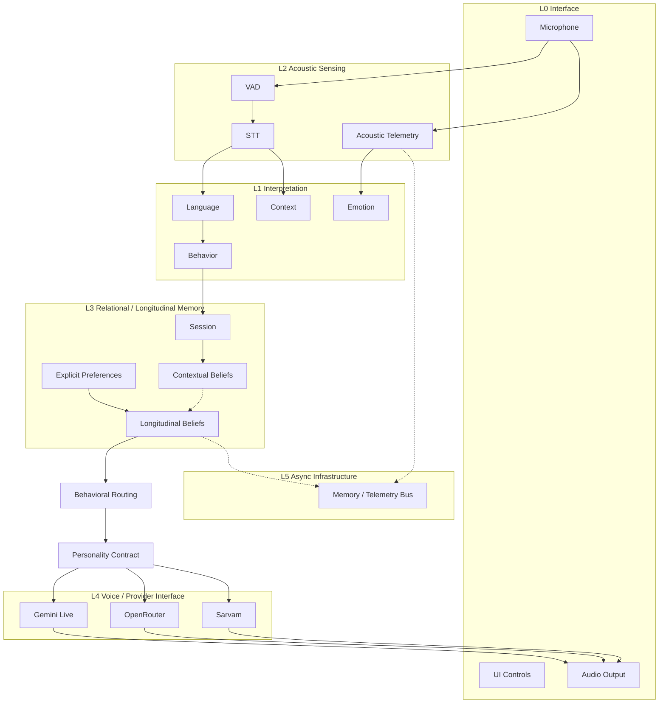
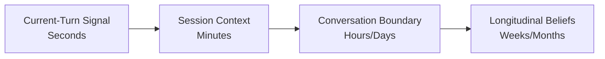
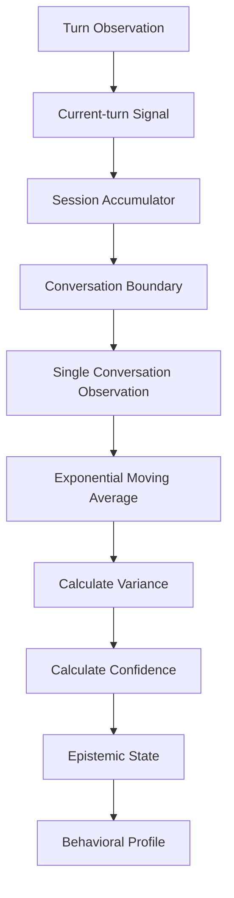
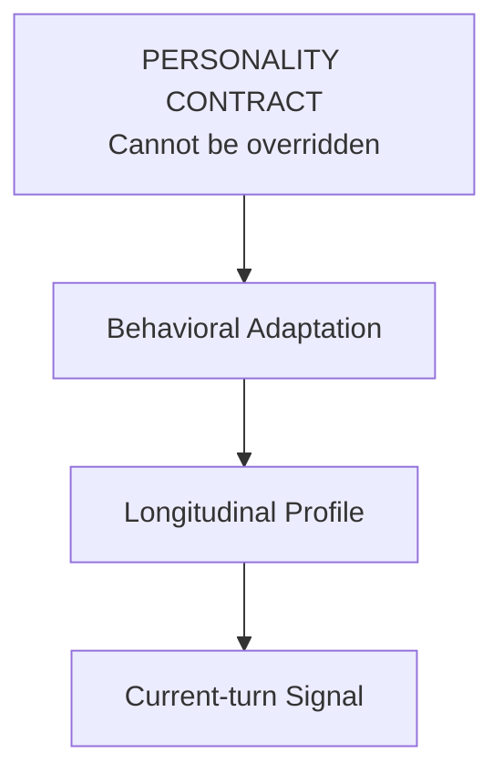
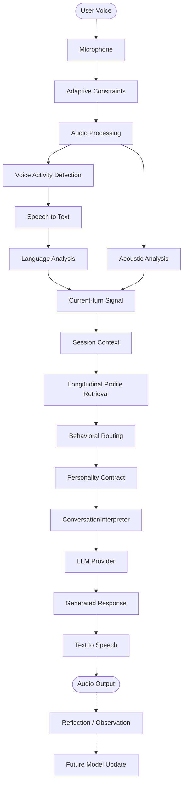
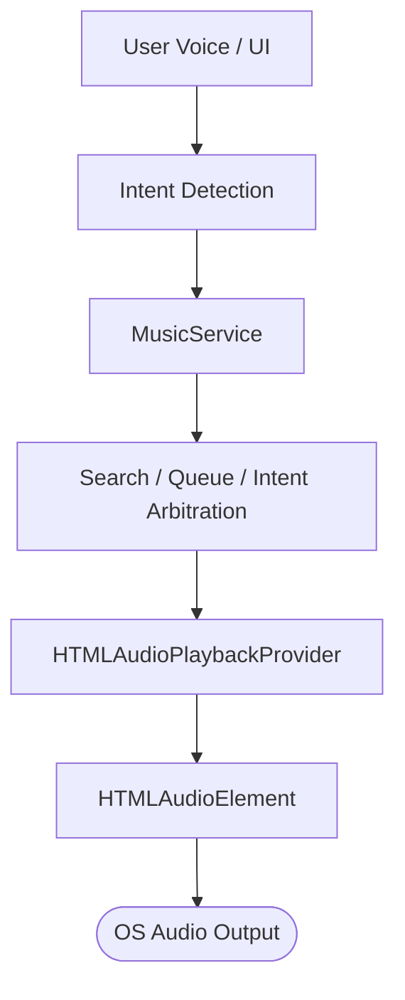
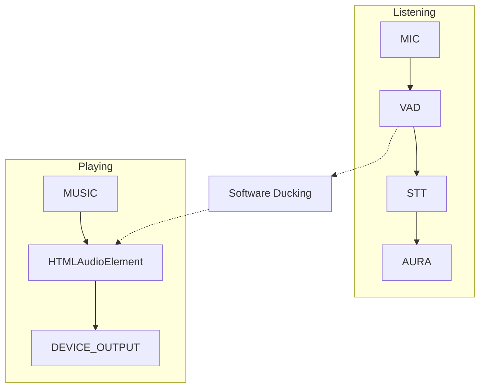
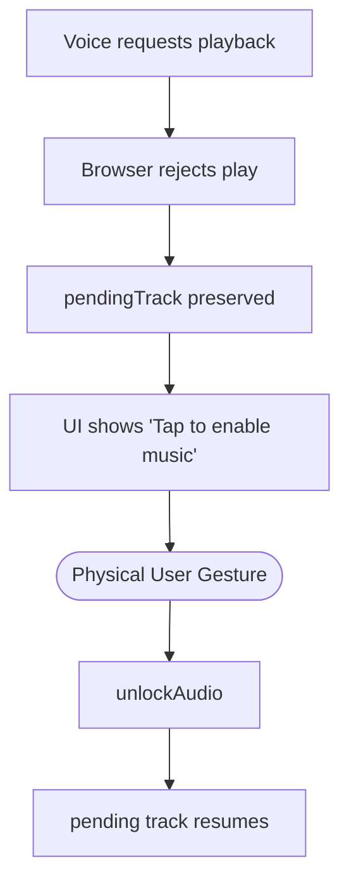

# AURA
### A conversational system that learns HOW to communicate with you.

Traditional voice AI is a simple pipeline:
`User → Speech Recognition → LLM → Speech Synthesis`

AURA is fundamentally different. It is not merely an LLM with a microphone. It is an interaction architecture wrapped around an LLM, designed to maintain continuity over time. 

**The AURA Pipeline:**
```text
Human
 ↓
Acoustic perception
 ↓
Linguistic perception
 ↓
Context interpretation
 ↓
Current behavioral state
 ↓
Session context
 ↓
Longitudinal beliefs
 ↓
Memory retrieval
 ↓
Behavioral routing
 ↓
Personality contract
 ↓
LLM reasoning
 ↓
Voice / action
 ↓
Observation
 ↓
Learning
```

---

## AURA in One Minute

For the first-time visitor, here is what AURA actually does:

*   **AURA listens:** It uses real-time, local Voice Activity Detection (VAD).
*   **AURA perceives both acoustic and linguistic signals:** It understands *how* you speak (pacing, volume) alongside *what* you say.
*   **AURA distinguishes transient behavior from stable patterns:** A bad day doesn't overwrite your core behavioral profile.
*   **AURA remembers relevant information:** Working memory, session context, and longitudinal memory are distinctly partitioned.
*   **AURA maintains a longitudinal communication model:** It learns how best to communicate with you using mathematically grounded moving averages.
*   **AURA adapts expression without surrendering personality:** It will change its tone and vocabulary, but never its core identity.
*   **AURA operates across multiple AI providers:** Gemini Live, OpenRouter, and Sarvam are all supported at parity.
*   **AURA controls music conversationally:** Music is a first-class subsystem, integrated directly into the cognitive architecture.
*   **AURA listens while music plays:** Full-duplex audio allows AURA to hear you over its own music without hard-pausing.
*   **AURA degrades gracefully:** If infrastructure fails, it falls back to simpler modes rather than crashing.

---

## The Difference: Chatbot vs AURA

A traditional chatbot treats every interaction as a blank slate. Even "memory-enabled" chatbots simply inject raw facts into the context window. They do not change their communication *style* based on long-term relationships.

AURA separates **Memory** (what happened) from **Belief** (how you communicate). By the time the LLM sees a prompt, AURA has already analyzed your acoustic envelope, retrieved its longitudinal belief about your preferred communication style, calculated its confidence in that belief, and injected strict behavioral routing constraints into the prompt—all before the LLM generates a single word.

---

## AURA in One Picture



---

## How AURA Perceives You

If you whisper, speak slowly, and pause often, a traditional AI only sees the transcribed text. AURA sees the **RMS volume drop**, the **extended silence spans**, and the **acoustic envelope**. It uses this non-verbal telemetry to infer your current behavioral state, allowing it to respond with appropriate warmth and volume, rather than answering a whispered question with maximum cheerfulness.

---

## The Six Cognitive Layers

### L0 — Interface
*   **What enters:** Raw audio streams, physical UI taps.
*   **What leaves:** Decoded audio buffers to the OS speaker.
*   **What it owns:** Hardware permissions, buffer management, browser AudioContext.
*   **What it must NOT decide:** It makes zero cognitive or behavioral decisions.

### L1 — Behavioral / Emotional Routing
*   **What it infers:** The emotional subtext and necessary response posture for the current interaction.
*   **How it influences style:** Injects specific instructions into the LLM system prompt regarding tone, verbosity, and vocabulary.
*   **What it never overrides:** The core Personality Contract. AURA will adapt *how* it speaks, but never *who* it is.

### L2 — Acoustic Perception
*   **What it measures:** RMS volume, silence durations, pacing, VAD thresholds, and the acoustic envelope.
*   **Microphone constraints:** Dynamically applies or removes hardware/software AEC (Acoustic Echo Cancellation) depending on whether you are using speakers or headphones.
*   **Why transcript-only fails:** Text loses sarcasm, exhaustion, urgency, and hesitation. L2 captures the signal beneath the semantics.

### L3 — Longitudinal Memory
*   **Mechanism:** Uses `sessionAccumulator` to aggregate the current conversation, then applies mathematically rigorous Exponential Moving Averages (EMA) to update long-term beliefs.
*   **Metrics:** Calculates variance, confidence, and resulting epistemic states.

### L4 — Voice / Provider Interface
*   **Abstraction:** Ensures provider parity. Whether utilizing Gemini Live's bidirectional WebSockets, OpenRouter's REST APIs, or Sarvam's localized Indian language models, the cognitive architecture above remains entirely consistent.

### L5 — Async Infrastructure
*   **Mechanism:** Redis/Valkey stream buses running completely asynchronously.
*   **Purpose:** Keeps the synchronous voice loop fast by offloading heavy database writes, telemetry aggregation, and vector embeddings to a side-channel.

---

## Current Turn vs Session vs Longitudinal Model

AURA treats time differently depending on the cognitive layer.



**CURRENT SIGNAL ≠ SESSION ≠ LONGITUDINAL BELIEF**

What you say in the next 5 seconds influences the current turn. That turn accumulates into the session context. Only when the conversation ends does AURA extract behavioral observations to gently shift its longitudinal beliefs.

---

## How AURA Learns



A long, 3-hour conversation does NOT receive proportional long-term influence simply because it contained more turns. It is aggregated at the boundary and treated as a single conceptual observation against your long-term behavioral baseline.

---

## Why AURA Doesn't Overlearn

Consider this scenario:

1.  **100 English conversations** → AURA establishes a stable English communication baseline.
2.  **1 unusual Hinglish conversation** → The `Current-Turn` signal changes immediately. The `Session` context reflects it. The `Longitudinal Model` barely moves. AURA speaks Hinglish *today*, but doesn't assume you will forever.
3.  **Repeated Hinglish conversations** → Evidence accumulates across boundaries. Variance stabilizes. Confidence rises. The `Longitudinal Belief` officially shifts.

The current true EMA half-life is:
`alpha = 1 - 0.5^(1/20)`

This means **20 independent conversations ≈ 50% remaining influence from the previous baseline.** It requires sustained behavioral evidence to rewrite AURA's beliefs about you.

---

## Epistemic States

Confidence in AURA is not simply "number of observations." It is a function of both evidence mass and variance.

| State | Meaning | Example | Behavioral Consequence |
| :--- | :--- | :--- | :--- |
| **KNOWN** | High evidence, low variance. | You always prefer concise technical answers. | AURA locks into this communication style without second-guessing. |
| **UNCERTAIN** | Insufficient evidence. | A new user or a completely new topic domain. | AURA uses a neutral, exploratory baseline and asks clarification questions. |
| **CONFLICTING** | High evidence, high variance. | You are technical on Mondays, but casual on Fridays. | AURA relies heavily on the `Current-Turn Signal` rather than the longitudinal baseline. |
| **RECENTLY_CHANGED** | Sustained anomaly detected. | You recently switched to speaking entirely in Spanish. | AURA tentatively adopts the new behavior but monitors closely for regression. |

---

## Personality vs Adaptation

AURA adapts *how* it communicates, not *who* it fundamentally is.



Even if you are highly sarcastic and chaotic, if AURA's Personality Contract is set to "Professional and Helpful", it will adapt by becoming more concise and direct to match your energy, but it will *not* become chaotic itself.

---

## Memory Architecture

AURA explicitly partitions memory into distinct layers, ensuring hallucinations in short-term context do not corrupt long-term data.

*   **Working / Short-term Context:** Stored in memory during the active turn. Cleared frequently.
*   **Session Context:** The running transcript and aggregated states for the current conversation.
*   **Longitudinal Beliefs:** EMA statistics and behavioral profiles, synchronized to persistent storage.
*   **Explicit Preferences:** Hard facts ("I am allergic to peanuts") managed by a separate deterministic pathway.
*   **Persistent Storage:** Serialized to `localStorage` on the client, with asynchronous synchronization to the backend database.

*(Note: Unlimited cloud memory is a function of the backend infrastructure; AURA gracefully degrades to local browser storage if offline).*

---

## What Happens When You Speak



---

## Provider Architecture

AURA abstracts the AI provider entirely, ensuring the cognitive architecture behaves identically regardless of the backend engine.

```text
                    AURA COGNITIVE CORE
                           │
             ┌─────────────┼─────────────┐
             ↓             ↓             ↓
        Gemini Live    OpenRouter      Sarvam
        WebSocket        REST          localized
             │             │             │
             └─────────────┼─────────────┘
                           ↓
                   Unified behavior
```

*   **Gemini Live:** Used for ultra-low-latency, bidirectional WebSocket interactions.
*   **OpenRouter:** Used for REST-based access to diverse open-source and proprietary models.
*   **Sarvam:** Used for highly localized Indian language and Hinglish interactions.

---

## Conversational Music

Music is a first-class conversational subsystem, not a tacked-on feature. AURA treats playback as a core state.



*   **One Playback Authority:** `MusicService` manages all queues and state. Obsolete duplicate components (`PlaybackEngine`, `PlayerStateMachine`) have been eliminated.
*   **Search Fallback:** If an exact track isn't provided, AURA dynamically searches and queues the best match.
*   **Race-Condition Protection:** Strict mutexes prevent overlapping audio fetch requests.

---

## Full-Duplex Audio

AURA listens while music plays. It intentionally **does not hard-pause** music simply because the microphone is armed.



**Mic active ≠ user speaking.** AURA utilizes software ducking, lowering music volume seamlessly only when VAD actually detects human speech, rather than brutally stopping the track.

---

## Mobile Audio Architecture

Mobile web browsers (especially iOS Safari) impose draconian restrictions on audio playback and microphone access.

*   **Speaker / Unknown Device:** AURA enables Acoustic Echo Cancellation (AEC), Noise Suppression (NS), and Auto Gain Control (AGC) to prevent the microphone from feeding AURA's own voice back into the STT engine.
*   **Headphones / Bluetooth:** AURA disables software AEC/NS where possible to prevent the OS from dropping into low-fidelity "Communications Mode", preserving music quality.

**The Gesture Unlock Path:**
If AURA attempts to play music via voice command, and the browser rejects the programmatic `.play()` call:



*(Note: iOS WebKit may still override JavaScript-level audio constraints at the hardware session level).*

---

## Security Architecture

```text
       Frontend (Vercel)                    Backend (Render / VM)
┌─────────────────────────────┐      ┌───────────────────────────────┐
│                             │      │                               │
│  UI / AudioContext          │      │  SSRF Protection              │
│  Client-side BYOK           │ ──── │  Media Proxy (yt-dlp)         │
│                             │      │  Strict Hostname Validation   │
│                             │      │                               │
└─────────────────────────────┘      └───────────────────────────────┘
```

*   **BYOK:** API credentials remain on the client.
*   **SSRF Protection:** The backend proxy strictly validates hostnames.
*   **No Edge Binaries:** `yt-dlp` and `ffmpeg` are entirely isolated to the backend proxy; the Vercel frontend is perfectly clean and serverless.

---

## Reliability & Graceful Degradation

AURA degrades gracefully rather than crashing when infrastructure fails.

```text
FULL MODE (All providers, Redis telemetry active, full memory)
 ↓
DEPENDENCY FAILURE (Redis down, external DB unreachable)
 ↓
SYNCHRONOUS FALLBACK (Local browser localStorage, inline context)
 ↓
PROVIDER FALLBACK (Gemini Live fails → falls back to OpenRouter REST)
 ↓
VOICE-ONLY FALLBACK (Basic STT/TTS loop without advanced cognition)
```

---

## Complete AURA Architecture

The ultimate loop that powers AURA:

```text
Human
 ↓
Sense (Acoustic / Linguistic)
 ↓
Interpret (Emotion / Context)
 ↓
Remember (Session / Short-term)
 ↓
Model (Longitudinal EMA)
 ↓
Adapt (Behavioral constraints)
 ↓
Reason (LLM Provider)
 ↓
Respond (TTS / Music Action)
 ↓
Observe (Turn results)
 ↓
Learn (Update longitudinal baseline)
 ↺
```
*(Side channels run concurrently: Music, Telemetry, Async Infrastructure).*

---

## Repository Structure

Based on the actual implemented architecture:

*   `backend/api/main.py`: Core backend API, SSRF-protected media proxy, webhooks.
*   `src/audioRuntime/`: Microphone coordination, AudioEnvironment constraints, VAD mathematics.
*   `src/core/`: Application orchestration, `useVoiceOrchestrator`, telemetry.
*   `src/executive/`: The cognitive brain. Contains `ConversationExecutive`, `SocialWorldModel`, `ConfidenceManager`, `StrategyPlanner`, etc.
*   `src/music/`: Unified `MusicService` and `HTMLAudioPlaybackProvider`.
*   `src/providers/`: Gemini WebSocket implementations, OpenRouter REST, Sarvam connectors.
*   `src/sense/`: Perception layers, diagnostic panels, sensory fusion.

---

## Getting Started

1.  **Install dependencies:** `npm install`
2.  **Start frontend development server:** `npm run dev`
3.  **Setup Backend (Python):** 
    *   `cd backend`
    *   `python3 -m venv venv && source venv/bin/activate`
    *   `pip install -r requirements.txt`
    *   `fastapi dev api/main.py`

---

## Current Capabilities

| Capability | Status | Architecture |
| :--- | :--- | :--- |
| Voice conversation | ✅ Implemented | Gemini Live WS / OpenRouter REST |
| Acoustic perception | ✅ Implemented | Local Silero VAD / `MicrophoneCoordinator` |
| Longitudinal beliefs | ✅ Implemented | `SocialWorldModel` / EMA mathematics |
| Contextual modeling | ✅ Implemented | `sessionAccumulator` / Epistemic states |
| Personality modes | ✅ Implemented | Strict Prompt Hierarchy |
| Gemini Live | ✅ Implemented | Bidirectional WebSockets |
| OpenRouter | ✅ Implemented | REST fallback |
| Sarvam | ✅ Implemented | Indian localized endpoints |
| Music playback | ✅ Implemented | `HTMLAudioPlaybackProvider` |
| Voice music control | ✅ Implemented | `MusicService` intent arbitration |
| Full-duplex audio | ✅ Implemented | Software ducking / VAD triggers |
| Mobile autoplay recovery| ✅ Implemented | Physical gesture unlock pipeline |
| Adaptive mic constraints| ✅ Implemented | `AudioEnvironment` dynamic AEC toggling |
| SSRF protection | ✅ Implemented | Strict hostname validation on backend |
| Graceful degradation | ✅ Implemented | Provider fallback chaining |

---

## Known Limitations

These are actual, architectural limitations of the current implementation:

1.  **iOS/WebKit Audio-Session Restrictions:** While AURA attempts to disable `{ echoCancellation: false }` for headphones to preserve audio fidelity, iOS Safari enforces hardware-level "Communications Mode" (HFP) when the microphone is accessed, which degrades playback audio quality. This is an OS restriction, not a JavaScript bug.
2.  **Physical-Device Validation Requirements:** True audio pipeline validation requires physical devices. Emulators cannot accurately simulate Bluetooth HFP switching or true acoustic echo.
3.  **Temporal Music Memory is NOT implemented:** AURA knows *what* track is playing and can control it, but it lacks a semantic timeline. "Replay from 1:30" works via timestamp seeking, but "Replay the chorus" requires semantic lyric alignment and segmentation, which does not exist yet.
4.  **Semantic Contradiction Depth is Limited:** AURA's variance detection easily catches obvious shifts (e.g., formal to casual), but highly subtle, multi-layered contradictions spread across weeks may bypass the EMA variance threshold.

---

## Roadmap

**Implemented:**
*   Single-authority `MusicService`.
*   Full-Duplex adaptive audio constraints and software ducking.
*   Longitudinal EMA belief model (`alpha = 0.034`).

**Hardening Completed:**
*   SSRF media proxy security.
*   Vercel edge compatibility (no local binaries).
*   Mobile browser autoplay recovery pipelines.

**Next Architectural Milestone:**
*   Temporal Music Memory (Semantic track timeline integration).
*   Deeply integrated cross-provider memory synchronization.

**Longer-term Research:**
*   Acoustic prosody extraction directly into the latent space (bypassing STT entirely).

---

## Closing Philosophy

AURA is not trying to make an LLM "pretend" to be a person. 

The goal is not deceptive humanization. The goal is to build the surrounding perception, memory, behavioral, audio, and interaction systems required for an AI to maintain **continuity** with a person over time. 

By modeling *how* to communicate rather than simply remembering *what* was said, AURA moves beyond the transactional nature of modern chatbots and toward a sustainable, longitudinal interaction model.
