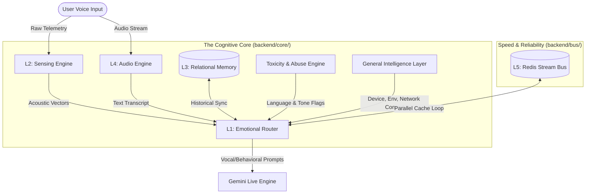

# **AURA: The Proactive Conversational Voice Companion**

AURA is an advanced, emotionally resonant voice companion engineered to bridge the gap between sterile AI interfaces and organic human presence. Built upon a **parallel multi-brain cognitive architecture**, AURA fuses real-time acoustic telemetry, dynamic emotional routing, relational memory sync, and sub-200ms latency to deliver a natural, co-present conversation loop.

---

## 🎨 AURA vs. Standard Voice Bots: The Human Difference

Contrast how a standard voice assistant and AURA handle the exact same human moment:

### The Scenario
A user comes home after a grueling 14-hour workday, speaking in a quiet, tired voice, pausing frequently.
> **User:** _(softly, pausing for 2 seconds)_ "Hey... I'm just really overwhelmed with work today."

| Dimension | Standard Voice Assistant | AURA Voice Companion |
| :--- | :--- | :--- |
| **Vocal Reception** | Ignores volume and pacing; parses only the text transcript. | **Processes raw acoustic telemetry:** Measures the low volume (RMS 0.008) and the heavy 2-second initial pause. |
| **Cognitive Reaction** | Treats it as a standard query; searches for stress relief advice. | **Adapts conversational arc:** Detects a _withdrawing_ emotional state and triggers a gentle, supportive prompt style. |
| **Contextual Memory** | Has no recollection of yesterday; starts the relationship from scratch. | **Enriches with relational memory:** Recalls that the user was preparing for a critical project launch this week. |
| **Vocal Delivery** | _Loud, energetic assistant voice:_ "I understand you are overwhelmed! Here are 5 ways to manage work stress. First, prioritize your tasks..." | _Soft, quiet, slightly slowed voice:_ "Oh... wahi launch na? Close your laptop, take a deep breath. We can catch up on this later, just relax right now, yaar." |

---

## 🧠 Inside AURA's "Five Brains"

AURA's processing power is distributed across five specialized "brains", now structured into a robust modular architecture that runs in parallel to construct a natural, zero-latency response.



### 1. L1: Core Emotional Routing Engine (`backend/core/behavior.py` & `emotion.py`)
- **What it does:** Decides **how** to speak before deciding **what** to say.
- **How it works:** Fuses multi-dimensional `EmotionVector` variables (warmth, tension, energy) with conversational trigger words to generate highly expressive, personality-consistent behavioral prompts dynamically.

### 2. L2: Telemetry & Sensing Module (`backend/core/sensing.py`)
- **What it does:** Measures the acoustic metadata of the user's voice—vocal envelope, volume, and silences.
- **How it works:** Computes real-time Root Mean Square (RMS) volume and silence duration to adjust AURA's speech delivery speed, tone, and active listening sensitivity.

### 3. L3: PGVector & Chroma Memory Sync (`backend/memory/sync.py`)
- **What it does:** Acts as AURA's persistent long-term memory.
- **How it works:** Implements a dual-mode storage gateway. When Supabase is online, it compresses and stores conversation threads via semantic embeddings. If offline, it seamlessly falls back to a circular, similarity-based `localStorage` buffer in the browser.

### 4. L4: Multimodal Audio Interface (`src/providers/`)
- **What it does:** Encapsulates the high-fidelity speech-to-text (STT) and text-to-speech (TTS) interfaces.
- **How it works:** Provides two core operations:
  - **Gemini Live WebSocket:** Zero-latency streaming via `useWebSocket.ts`.
  - **Sarvam Pipeline:** Indian-localized voice interface using Sarvam’s state-of-the-art `saaras:v2` STT models and `bulbul:v3` voices with robust code-mixed **Hinglish** support.

### 5. L5: Asynchronous Redis Stream Bus (`backend/bus/`)
- **What it does:** Decouples computational operations from the conversational stream.
- **How it works:** Houses a central `RedisBus` (`redis.py`) that acts as a low-latency event broker, allowing background consumers (`consumer.py`) to process emotional matrices, vocab updates, and vector writes in parallel under 200ms.

---

## 📂 Modern Modular Directory Structure

The project has been cleaned and reorganized into structured directories, decoupling legacy operations from the hardened production pipeline:

```
├── backend/                       # Modernized FastAPI & Python Core
│   ├── api/                       # API entry points, rate limiting, and CORS routing
│   │   └── main.py                # Main server controller & BYOK dynamic credential injector
│   ├── bus/                       # Redis event-bus streams and consumers
│   │   ├── consumer.py            # Resilient background queue and stream processor
│   │   └── redis.py               # Asynchronous Redis/Valkey client singleton
│   ├── core/                      # Core Cognitive Architecture
│   │   ├── behavior.py            # Behavior Engine (Vocal Directives & Toxicity filter)
│   │   ├── emotion.py             # Emotion Vector system (Warmth, Tension, Energy mapping)
│   │   ├── relationship.py        # Relational and attachment score tracker
│   │   └── vocab.py               # Real-time Hinglish slang vocabulary learner
│   ├── infrastructure/            # Shared platform and system dependencies
│   │   └── embedding_provider.py  # Multi-tier embeddings chain (Gemini -> Cohere -> FastEmbed -> None)
│   ├── memory/                    # Persistent storage adapters
│   │   └── sync.py                # Dual-mode memory sync and PGVector client
│   └── degradation.py             # Circuit breakers and progressive degradation manager
│
├── src/                           # Hardened Vite + React Frontend
│   ├── components/                # Modular UI Components
│   │   ├── LatencyMeter.tsx       # Live L1-L5 cognitive latency visualization
│   │   ├── RedisManager.tsx       # Visual Redis control board, stat monitor, and stream purger
│   │   └── StorageSettings.tsx    # Two-Tier settings disclosure (Credentials & Power-Ups)
│   ├── lib/                       # Core client-side abstractions
│   │   ├── api.ts                 # Dynamic API handlers
│   │   ├── credentials.ts         # Secure client-side credential storage and BYOK headers
│   │   └── behavior-client.ts     # Client side behavior analyzer and adapter
│   └── providers/                 # Speech & WebSocket Stream hooks
│       ├── gemini/                # Gemini Live WebSocket interfaces
│       └── sarvam/                # Sarvam voice interfaces
│
├── docs/                          # Cleaned documentation
│   └── architecture/              # High-level architecture and fail-safety maps
│       └── full_arch_description.md # Comprehensive 15KB AURA architectural specification
│
└── legacy/                        # Deprecated Python scripts (retained for fallback audit)
```

---

## 🛠️ Production Hardening & Security Features

* **BYOK (Bring Your Own Key) Pipeline:** Credentials for Gemini, OpenRouter, Cohere, Pinecone, and Redis are managed via secure headers injected at the client layer. 
* **Safe Redis Connection Management:** The `update_byok_credentials` middleware strips surrounding quotes and trailing whitespace, ignoring empty values to prevent client-side overrides from breaking active environment connections.
* **HTTPS Geolocation Privacy:** Real-world grounding location lookups (`geo_engine.py`) utilize secure, encrypted `HTTPS` endpoints exclusively, protecting client IP addresses from network-level interception.
* **Stream Resilience:** The background stream consumer automatically catches `NOGROUP` exceptions during Redis stream restarts, immediately executing `xgroup_create` with `mkstream=True` to prevent infinite system crashes.

---

## 🚀 Getting Started

### Prerequisites
* **Node.js** (v18+)
* **Python 3.12+**
* **System Compilers:** `gcc`, `gcc-c++`, `make` (required to compile database and high-speed telemetry packages)

### Backend setup
1. Initialize the virtual environment:
   ```bash
   python3 -m venv venv
   source venv/bin/activate
   ```
2. Install dependencies:
   ```bash
   pip install -r requirements.txt
   ```
3. Run the FastAPI development server:
   ```bash
   uvicorn backend.api.main:app --reload --port 8000
   ```

### Frontend setup
1. Install package dependencies:
   ```bash
   npm install
   ```
2. Run the Vite developer server:
   ```bash
   npm run dev
   ```

---

## ⚠️ Circuit Breakers & Degradation Levels

If critical modules fail, AURA progressively degrades its interface gracefully rather than crashing:
1. **Full Mode:** Asynchronous Redis processing, Supabase memory retrieval, and cloud embedding caches are active.
2. **Sync Fallback Mode:** If Redis or Valkey is unreachable, AURA reverts to synchronous processing via local pipelines seamlessly.
3. **Voice-Only Fallback:** If cloud cognitive layers fail entirely, AURA degrades to static fallback prompts using local browser synthesis, ensuring the voice loop is never broken.

<p align="right">
  <sub>⏱️ <i>Hardening & System Optimization: <b>Still Progressing...</b></i></sub>
</p>
