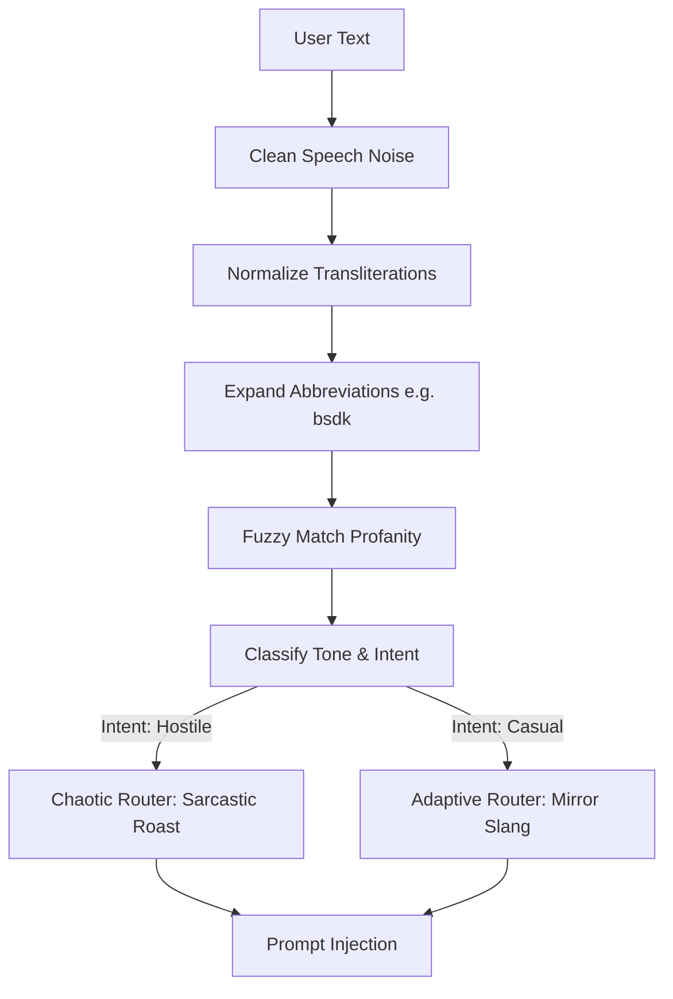

# AURA — Comprehensive Architectural & Request Lifecycle Blueprint

**Date:** 2026-09-10
**Status:** Canonical Multi-Provider & Perception Architecture Active

This document provides a highly structured, exhaustively detailed, and precise explanation of the AURA architecture. It maps the complete project file structure, data models, and describes the exact pipeline logic of how all backend and frontend components coordinate to process conversational turns in real-time.

---

## 1. Complete Project File Structure & Responsibilities

Below is the directory mapping of the core system components, categorized by their exact architectural function and structural behavior:

```
AURA_CHAT/
├── backend/
│   ├── api/
│   │   ├── main.py              # FastAPI entry. Exposes `/api/analyze`, `/api/analyze/stream`, `/chat`, `/session/start`.
│   │   ├── contracts.py         # Pydantic schemas: ChatRequest, AnalyzeRequest, Response models.
│   │   ├── cron.py              # Background maintenance routines & session consolidation.
│   │   ├── memory_endpoints.py  # REST endpoints for memory retrieval and management.
│   │   └── webhooks.py          # QStash / asynchronous webhook endpoints.
│   ├── bus/
│   │   ├── redis.py             # Redis client wrapper, stream management, transcript publishing.
│   │   └── consumer.py          # Background async stream consumer.
│   ├── core/
│   │   ├── behavior.py          # Brain 2: RuntimeEngine, SensingEngine & StateVector calculations.
│   │   ├── sensing.py           # Brain 2: 15-dim StateVector, emotional arc tracking, continuous decay.
│   │   ├── vocab.py             # Brain 5: Multilingual vocabulary (Hindi, Hinglish, English) & tone profiling.
│   │   ├── relationship.py      # Relationship tracking & trust stage management.
│   │   ├── proactive.py         # Idle session monitoring & proactive engagement.
│   │   └── intelligence/        # LLM streaming pipelines, action schema, prompt composition.
│   ├── infrastructure/
│   │   ├── degradation.py       # Circuit breakers (redis, supabase, worker, embedding_api).
│   │   ├── rate_limiter.py      # Sliding-window rate limiter.
│   │   ├── embedding_provider.py# Multi-tier embeddings: Gemini → Cohere (MRL) → FastEmbed → FTS.
│   │   └── embedding_cache.py   # Redis embedding deduplication cache.
│   └── memory/
│       ├── chroma.py            # ChromaDB / Supabase pgvector proxy.
│       ├── sync.py              # Memory persistence, match_memories_v2 RPC queries.
│       └── orchestration/       # Canonical MemoryOrchestrator coordination.
├── src/                         # Frontend Web Application (React / Vite / TypeScript / TailwindCSS)
│   ├── core/
│   │   ├── useVoiceOrchestrator.ts # Root orchestrator: boots SenseManager & RuntimeManager, binds providers.
│   │   └── IVoicePipeline.ts    # Unified contract for all voice pipelines.
│   ├── runtime/                 # Central Cognitive & Decision Runtime
│   │   ├── RuntimeManager.ts    # Canonical gateway for cognitive turn processing and routing.
│   │   ├── conversationInterpreter/ # Formats unified [COGNITION], [HUMAN STATE], [SENSE EVIDENCE].
│   │   ├── decision/            # RuntimeDecisionBuilder (SPEAK, WAIT, BACKCHANNEL).
│   │   ├── socialCognition/     # Presence & social context arbitration.
│   │   └── attention/           # AdaptiveAttentionLayer (atmosphere relevance assessment).
│   ├── sense/                   # Perception Subsystem
│   │   ├── SenseManager/        # Sense Supervisor & registry singleton.
│   │   ├── PerceptionFusionLayer.ts # Temporal sliding windows & evidence fusion.
│   │   ├── VoiceSense/          # Acoustic perception adapter (speechProbability, audio context).
│   │   └── MusicSense/          # Music perception adapter (playback & track context).
│   ├── providers/               # Swappable Voice & Text Intelligence Providers
│   │   ├── gemini/              # Gemini Live full-duplex WebSocket integration (`useLiveNext.ts`).
│   │   ├── openrouter/          # OpenRouter streaming + TTS pipeline (`useProvider.ts`).
│   │   └── sarvam/              # Sarvam STT / TTS pipeline (`useSarvam.ts`).
│   ├── music/                   # Music Engine (PlaybackState, MusicService, UI audio player).
│   └── lib/                     # Memory gateway, behavior client, latency & telemetry utilities.
└── extracted_data/              # Precompiled baseline emotional heuristics and dataset templates.
```

---

## 2. The 5-Brain Cognitive Architecture: Precise Anatomy

AURA strictly partitions its cognitive, sensory, and persistence tasks into **5 distinct brains** to guarantee instant response times under `<20ms` for the critical audio loop, while asynchronously driving deep emotional profiling:

### Brain 1: Sensory & Voice I/O (Frontend Orchestrator)

- **Role:** Handles WebRTC Audio streams, hardware microphone context, Voice Activity Detection (VAD), and WebSocket connectivity with the Gemini Live Audio Model.
- **Data Model Trigger:** Emits `{ user_text: string, audio_rms: number, pause_ms: number, wasInterrupted: boolean }` upon VAD silence.

### Brain 2: Emotional Core & Reasoning (Backend Analytical Core)

- **Role:** Maintains the continuous temporal emotional state of the user.
- **The StateVector (15-Dimensional Space):**
  - Continuous Metrics: `energy` (0-1), `warmth` (0-1), `engagement` (0-1), `trust` (0-1), `tension` (0-1).
  - Derived Metrics: `arc` (string: building, maintaining, withdrawing, escalating, recovering), `arc_turns` (int), `session_turn` (int), `companion_boost_count` (int).
- **Temporal Decay:** Half-lives are applied to emotions over absolute wall-clock time (e.g., tension halves every 45s, trust halves every 5.6m).
- **[AUDIT RISK] Global State Bleed:** `RuntimeEngine.turn_history` and `_sensing_engines` are currently implemented as stateful class instance variables and global dictionaries. In a multi-worker production environment, this causes severe memory leaks (OOM) and cross-session emotional contamination.

### Brain 3: Async Message Bus & Offline Execution (Redis/Worker)

- **Role:** Decouples the massive AI lookup penalty from the real-time websocket loop.
- **Protocol:** `server.py` executes an O(1) `XADD` to the `aura:transcripts` stream and an O(1) `HGET` on `active_session_cache:{session_id}`. `behavior_engine_consumer.py` uses `XREADGROUP` to pop messages and performs all Brain 2, 4, and 5 computations offline.

### Brain 4: Long-Term Episodic Memory (Supabase pgvector)

- **Role:** Retrieves dense historical context using a highly resilient multi-tier fallback pipeline.
- **Embedding Chain:** Uses `embedding_provider.py` to route embedding generation: Gemini API (768d) → Cohere API (Truncated via MRL to 768d) → Local FastEmbed (BGE-base 768d) → Postgres FTS (keyword search).
- **Execution:** Uses `get_chromadb_enrichment_v2()`. Embeddings are passed against `supabase_client.rpc('match_memories_v2')`, which executes a hybrid ranking algorithm combining vector distance (cosine similarity) with a chronological recency booster.
- **[AUDIT RISK] Vector Space Collapse:** `embedding_cache.py` keys the Redis cache exclusively by text hash. During a provider failover (e.g. Gemini to Cohere), the cache will incorrectly serve Gemini vectors into the DB alongside Cohere vectors, destroying similarity search capabilities.

### Brain 5: Vocabulary & Adaptive Toxicity Engine

- **Role:** Detects structural syntax (Hindi vs. English vs. Hinglish). Maintains an ongoing dictionary of user-specific vocabulary, slang, and abusive phrases, pushing explicit tone-matching instructions back to Brain 2.
- **Toxicity Pipeline:**



### Brain 6: General Intelligence Context Layer (Middleware)

- **Role:** Extracts real-world dimensions (Time, Device, Environment) to ground the conversational intelligence.
- **Components:**
  - **Device Engine:** Hardware stats (Mic status, battery, connectivity).
  - **Environment Engine:** Location and temporal acoustic context (e.g. background noise proxy).
  - **Fallback Engine:** Gracefully catches system collapses and circuit breaker trips, maintaining prompt integrity.

---

## 3. Dynamic Request Turn Flow: Exact Data Lifecycle

Every conversational turn flows through a decoupled, speculatively-optimized pipeline.

### Step-by-Step Execution Lifecycle

1. **VAD Active & Speculative Trigger (`useBehaviorInjection.ts` & `behavior-client.ts`)**
   - As the user speaks, `useAudioPipeline.ts` monitors the microphone.
   - The transcript is parsed continuously. When the text exceeds **4 words** and a **500ms** pause is detected (`shouldSpeculate()` condition met), the frontend fires `fireSpeculative()`.
   - This sends an out-of-band `POST /api/analyze` containing the partial text. The backend processes it. If the user continues speaking, the `AbortController` terminates the client fetch.

2. **VAD Silence & Turn Commitment (`useGeminiLive.ts`)**
   - The user stops speaking. Native browser VAD fires `turnComplete`.
   - The frontend immediately sends `sendClientContent({ turnComplete: true })` over the WS.
     - **[AUDIT RISK] Destructive VAD Overwrite**: Currently, `useLive.ts` forces this flag inside the transcription callback, prematurely interrupting user speech on partial text.
   - Simultaneously, it calls `analyzeForTurn()`. If the user's final speech matches the speculative cache (`isSpeculativeResultUsable()`), the network call is skipped (Cache Hit). Otherwise, it fires the final `POST /api/analyze`.

3. **Hot-Path Gateway Routing (`server.py`)**
   - The API receives the payload: `AnalyzeRequest(user_text, session_id, user_id, audio_rms...)`.
   - **Rate Limiting:** `apply_rate_limit()` evaluates the Redis sliding window (60 req/min).
   - **Circuit Validation:** `degradation.level` checks Redis health. If `redis` is unavailable, the system defaults to synchronous processing.
   - **Async Publish:** `_safe_background()` executes `publish_transcript()` injecting the turn into `aura:transcripts`.
   - **Cache Retrieval:** The server queries Redis for the precompiled `AnalyzeResponse` generated during the _previous_ turn's consumer execution.
     - **[AUDIT RISK] Permanent 1-Turn Context Lag**: Because the frontend reads the response instantaneously, it reads the _previous_ turn's cache before the consumer has finished processing the _current_ turn. The LLM is permanently injected with behavioral instructions that are one step behind.
   - **Immediate Return:** The cached `AnalyzeResponse` is returned to the client in `<20ms`.

4. **Background Offline Analytical Execution (`behavior_engine_consumer.py`)**
   - The worker node pops the raw turn from the Redis stream and sequentially invokes the pipeline:
   - **Phase A (Emotion):** `RuntimeEngine.analyze()` scores the text (e.g., `frustration: 0.8`).
   - **Phase B (State):** `build_sensing_injection()` recalculates the 15-dim `StateVector` based on the scores and real-time decay formulas, outputting an explicit `directive` (Mode: _Reassure_, Injection Type: _Urgent_).
   - **Phase C (Vocab):** `VocabLearner.ingest_turn()` extracts new lexical tokens and evaluates the user's language profile (Hindi/Hinglish structural matching).
   - **Phase D (Memory):** `get_chromadb_enrichment_v2()` calls Gemini `embedding-001` (cached via `embedding_cache.py`), queries pgvector, and retrieves the top-k semantic memories.
   - **Phase E (Relationship):** `RelationshipTracker.update_trust()` adjusts long-term bonding scores and returns the appropriate trust profile injection.
   - **Hot Cache Commit:** The worker combines the emotional directives, memory, and relationship data into the final `AnalyzeResponse` dictionary and executes `write_cached_analysis()`. This result awaits the _next_ `/api/analyze` hit.

5. **Behavioral Prompt Injection (`useBehaviorInjection.ts`)**
   - The frontend receives the `<20ms` hot-path analysis.
   - If `injection_type` == `urgent` (e.g., high user frustration detected):
     - It forcibly injects a hidden user turn: `[BEHAVIORAL CONTEXT]: {behavior_instructions}` directly into the Gemini session before Gemini synthesizes the output audio.
   - If `passive`: It merges the instructions softly into the standard prompt stack.

6. **Barge-In Interruption (`useInterruptionHandler.ts`)**
   - While Gemini responds (TTS streaming), the audio pipeline continuously tracks mic input RMS.
   - If RMS exceeds `BARGE_IN_THRESHOLD` (`0.018`), the `wasInterrupted` flag is raised.
   - The frontend calls `window.speechSynthesis.cancel()` (for OpenRouter fallback) or sends an interruption event to Gemini, silencing output instantly and gracefully routing the user's new utterance to Step 1.

---

## 4. Fallback Mechanics & Circuit Degradation (`degradation.py`)

AURA operates under strict **fail-open** reliability engineering:

| Failure Point                 | Action / Degradation Path                                                         | Impact to User                                                           |
| :---------------------------- | :-------------------------------------------------------------------------------- | :----------------------------------------------------------------------- |
| **Redis Down**                | Bypass Brain 3 Stream + Cache. Fallback to inline sync processing in `server.py`. | Latency increases (~800ms) but chat works seamlessly.                    |
| **Supabase pgvector Down**    | `store_memory` fails gracefully via `_safe_background`. DB queries short-circuit. | Loss of long-term episodic memory enrichment. Live chat unaffected.      |
| **Gemini Embedding API Down** | Embedding chain fails over to Cohere (MRL Truncated) or Local FastEmbed.          | Seamless transition, provided cache key collision risk is patched.       |
| **Complete System Collapse**  | Circuit forces `DegradationLevel.VOICE_ONLY`. Empty directives returned.          | AURA acts as a standard voice-relay bot. No behavioral context injected. |

> [!IMPORTANT]
> All peripheral failure exceptions are trapped, isolated to their respective subsystems, and piped into structured logging (`structlog`). The audio conversational loop is strictly protected and will never block or crash due to background component timeouts.
> **[AUDIT RISK] Zombie Threads:** Circuit breaker implementations currently rely on `asyncio.wait_for`. When a timeout is triggered on synchronous external SDKs (like `supabase` wrapped in `asyncio.to_thread`), the python threads continue executing indefinitely, accelerating thread pool starvation under load.
