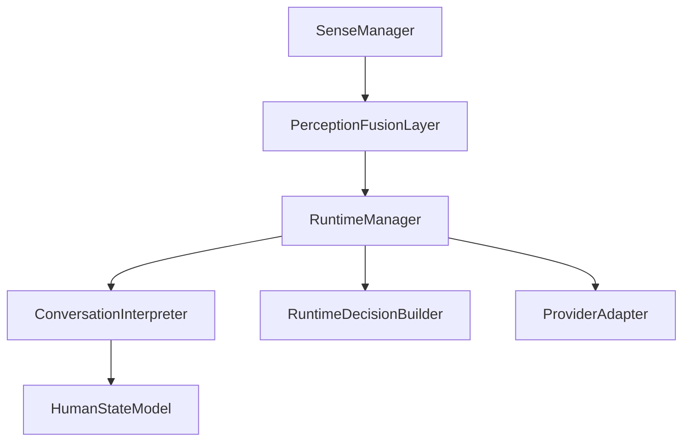

# AURA Forensic Repository Architecture

**Generated:** 2026-08-13
**Scope:** Current AURA codebase (Phase F implemented).

## 1. Executive Summary

AURA is an adaptive, multimodal conversational agent. This document maps the *actual* implemented architecture within the repository.
The architecture successfully implements the canonical cognitive pipeline (Phases A–F), utilizing a unified `RuntimeManager` as the gateway for cognitive execution and `SenseManager` for perception.

**Architectural Paradigm:**
- **Perception:** A multi-sense framework (Voice, Music) driven by `SenseManager` and `PerceptionFusionLayer`.
- **Cognition & Human State:** Isolated from raw signals; operates on probabilistic hypotheses.
- **Decision:** Explicitly arbitrates behavior (`SPEAK`, `WAIT`, `BACKCHANNEL`) based on interpreted cognition.
- **Providers:** Strict adapters executing canonical decisions.

## 2. Current Architecture Diagram

```mermaid
graph TD
    subgraph PERCEPTION
        Mic[Microphone] --> AudioPipeline[useVoiceAcoustics / Silero]
        AudioPipeline --> Store[voicePerceptionStore]
        Store --> VoiceSense[VoiceSense]
        Spotify[Music App] --> MusicSense[MusicSense]
    end

    subgraph SENSE RUNTIME
        VoiceSense --> SenseManager
        MusicSense --> SenseManager
    end

    subgraph FUSION
        SenseManager --> Fusion[PerceptionFusionLayer]
    end

    subgraph HUMAN STATE
        Fusion --> HSM[HumanStateModel]
    end

    subgraph COGNITION
        HSM --> CI[ConversationInterpreter]
    end

    subgraph DECISION
        CI --> RM[RuntimeManager]
        RM --> DB[RuntimeDecisionBuilder]
        DB --> RM
    end

    subgraph PROVIDERS
        RM --> OpenRouter Adapter
        RM --> Sarvam Adapter
        RM --> Gemini Live Adapter
    end

    OpenRouter Adapter --> TTS
    Sarvam Adapter --> TTS
    Gemini Live Adapter --> WebSocket Voice
```

## 3. Repository / Folder Tree

```text
AURA_CHAT/
├── src/
│   ├── core/              # Global orchestrators (useVoiceOrchestrator, telemetry)
│   ├── hooks/             # Shared React hooks (e.g., useVoiceAcoustics)
│   ├── lib/               # Utilities, integrations, local memory, behavior client
│   ├── music/             # Music system (Player, queue, APIs, MusicService)
│   ├── providers/         # Backend intelligence adapters
│   │   ├── core/          # ProviderAdapter & contracts
│   │   ├── gemini/        # Gemini Live WebSocket integrations (useLive)
│   │   ├── openrouter/    # OpenRouter Text-to-Speech implementation
│   │   └── sarvam/        # Sarvam Text-to-Speech implementation
│   ├── resilience/        # Legacy error handling orchestration
│   ├── runtime/           # Central Cognitive & Decision Runtime
│   │   ├── conversationInterpreter/ # Builds cognitive blocks & formatting
│   │   ├── decision/      # RuntimeDecisionBuilder (SPEAK, WAIT, BACKCHANNEL)
│   │   ├── humanExpression/ # Expression formatting engine
│   │   ├── humanState/    # Phase F: Affective intelligence and hypothesis mapping
│   │   └── RuntimeManager.ts # Canonical orchestration gateway
│   └── sense/             # Perception components
│       ├── SenseManager/  # Sense Supervisor
│       ├── PerceptionFusionLayer.ts # Merges sense observations into temporal evidence
│       ├── VoiceSense/    # Acoustic Perception Adapter
│       └── MusicSense/    # Music Perception Adapter
├── scripts/               # Testing & verification harnesses (Phase regressions)
├── docs/                  # Architecture specs and forensic reports
└── public/                # Static assets, WebWorkers (PCM, VAD)
```

## 4. Architectural Layer Map

| Layer | Responsibility | Key Files |
|-------|---------------|-----------|
| **Human** | Environment/Speech | `AudioContext` (Browser) |
| **Perception** | Raw signal observation | `useVoiceAcoustics.ts`, `pcm-capture-processor.js`, `silero_vad.onnx` |
| **Sense Runtime** | Canonical Sense interface | `SenseManager.ts`, `VoiceSense.ts`, `MusicSense.ts` |
| **Fusion Layer** | Evidence & temporal baseline | `PerceptionFusionLayer.ts` |
| **Human State** | Affective inference & decay | `HumanStateModel.ts` |
| **Cognition** | Prompt & context formation | `ConversationInterpreter.ts` |
| **Decision** | Behavior Arbitration | `RuntimeDecisionBuilder.ts`, `RuntimeManager.routeDecision` |
| **Execution** | Instructing providers | `RuntimeManager.ts` |
| **Providers** | Generating response | `useLive.ts`, `useSarvam.ts`, `useProvider.ts` |

## 5. Runtime Call Graph

**Standard Processing Flow:**
1. User speaks → `useVoiceAcoustics.ts` captures PCM, Silero processes VAD, updates `voicePerceptionStore.ts`.
2. Provider hook (`useSarvam.ts` or `useProvider.ts`) triggers processing at speech end.
3. Provider hook calls `RuntimeManager.getInstance().processCognitiveTurn()`.
4. `RuntimeManager` pulls observations via `SenseManager.collectAllContext()`.
5. `SenseManager` pulls from `VoiceSense` (which reads `voicePerceptionStore`) and `MusicSense`.
6. Observations are fused in `PerceptionFusionLayer` (adding temporal data like "increasing").
7. Fused Evidence is passed to `HumanStateModel` via `ConversationInterpreter`.
8. `HumanStateModel` produces probabilistic affective hypotheses with confidence decay.
9. `ConversationInterpreter` formats cognitive context `[COGNITION]`, `[HUMAN STATE]`, `[SENSE EVIDENCE]`.
10. `RuntimeManager` queries backend behavior and executes `evaluateDecision()` yielding a `ProviderExecutionDirective` (`SPEAK`, `WAIT`, `BACKCHANNEL`).
11. Provider hook receives `directive.action`, either halting or generating a response text.
12. TTS engine plays the response.

## 6. Sense Architecture

| Sense | Implementation | Runtime | Evidence | Fusion | Cognition | Status |
|-------|---------------|---------|----------|--------|-----------|--------|
| **Voice** | `VoiceSense.ts` | Adapts `useVoiceAcoustics` | `speechProbability` | Validated | Yes | Canonical |
| **Music** | `MusicSense.ts` | Adapts `MusicService` | `track`, `state` | Validated | Yes | Canonical |

## 7. Voice Pipeline

1. **Microphone**: `getUserMedia` in `useVoiceAcoustics.ts`.
2. **Workers**: `pcm-capture-processor.js` handles audio chunking; passes to `vad-processor.js`.
3. **Detection**: Silero ONNX model (in-browser) scores VAD frames.
4. **Perception**: `useVoiceAcoustics` aggregates RMS energy, pace, VAD into `ListeningState`.
5. **Bridge**: `voicePerceptionStore` caches the latest `ListeningState`.
6. **Adapter**: `VoiceSense.ts` implements `BaseSense`, reading the store for the Fusion layer.

## 8. Fusion / Evidence Architecture

- **`PerceptionFusionLayer.ts`**: Implements temporal sliding windows to detect `increasing`, `decreasing`, `sudden_change` features in `SenseEvidenceV1`. Preserves contradiction without early dropping.

## 9. Cognition Architecture

- **`ConversationInterpreter.ts`**: The canonical prompt formatter.
- **`HumanStateModel.ts`**: Transforms fused evidence into affective dimensions (`valence`, `arousal`, `tension`) and string hypotheses.
- **`ResponseArchitecturePlanner.ts` / `HumanResponsePlanner.ts`**: Decides how the response should be formatted.

## 10. Decision Architecture

- **`RuntimeManager.ts` (`routeDecision`)**: Decodes the cognitive interpretation.
- **`RuntimeDecisionBuilder.ts`**: Formulates `RuntimeDecision` (e.g. intent to `Hold` vs `Respond`).
- **`ProviderExecutionDirective`**: Output type with `action: "SPEAK" | "WAIT" | "BACKCHANNEL"` and `delayMs`.

## 11. Execution Architecture

Execution is deferred back to the provider hook which translates the `action` into streaming TTS, silent buffering, or cancellation.

## 12. Provider Architecture

| Provider | Cognition Pipeline | Decision Handler | Streaming | Status |
|----------|-------------------|------------------|-----------|--------|
| **Gemini Live** | `processCognitiveTurn` | Honors `action` | Native WS | Canonical |
| **Sarvam** | `processCognitiveTurn` | Honors `action` | Custom TTS | Canonical |
| **OpenRouter** | `processCognitiveTurn` | Honors `action` | Custom TTS | Canonical |

## 13. State Ownership

| State | Owner | Lifetime | Mutable? | Consumers |
|-------|-------|----------|----------|-----------|
| Perception (Acoustic) | `voicePerceptionStore` | High Frequency (ms) | Yes | `VoiceSense` |
| Music State | `MusicService` | Session | Yes | `MusicSense`, App UI |
| Human State (Affective) | `HumanStateModel` | Session (Decays) | Yes | `ConversationInterpreter` |
| Local Chat History | `aura-memory.ts` | Persistent (Local) | Yes | Provider Prompts |

## 14. Telemetry / Observability Map

- **`RuntimeTelemetry.ts`**: Monitors `RuntimeManager` actions.
- **`CognitionTelemetry.ts`**: Logs cognitive architectures used in `ConversationInterpreter`.
- **`trace-runtime.ts`**: Exposes critical UI diagnostics for FlightRecorder and overlays.

## 15. Memory Map

- **Transient/Temporal**: `PerceptionFusionLayer` buffers 5 observations per source.
- **Session/Stateful**: `HumanStateModel` buffers affective dimensions, decays toward 0 after `60000ms`.
- **Conversational**: Local memory gateways (`useSarvam.ts` syncs turn interaction history locally if enabled).

## 16. Legacy / Duplication Audit

- **`ConversationExecutive`**: DEAD/REMOVED. Replaced by `ConversationInterpreter` and `RuntimeManager`.
- **`useProvider.ts` / `useSarvam.ts` Local Heuristics**: REMOVED. Both now use `RuntimeManager.processCognitiveTurn`.

## 17. `<audio_context>` Audit

- **Generated In**: `useVoiceAcoustics.ts` (`stopTrackingAndAnalyze`).
- **Consumed By**: `useSarvam.ts` and `useProvider.ts` string prompts.
- **Status**: LEGACY duplicate of `VoiceSense`.
- **Recommendation**: Can be safely stripped out of `gemini-prompt.ts` and `useVoiceAcoustics.ts` now that `VoiceSense` covers acoustic temporal features via standard cognitive formatting.

## 18. Dependency Graph



## 19. File-to-Responsibility Index

| File | Responsibility | Used By | Status |
|------|---------------|---------|--------|
| `RuntimeManager.ts` | Central orchestration | Provider Hooks | Canonical |
| `ConversationInterpreter.ts` | Prompt contextualization | `RuntimeManager` | Canonical |
| `HumanStateModel.ts` | Affective Intelligence | `ConversationInterpreter`| Canonical |
| `SenseManager.ts` | Perception Aggregation | `RuntimeManager` | Canonical |
| `PerceptionFusionLayer.ts` | Temporal Analytics | `SenseManager` | Canonical |
| `ProviderAdapter.ts` | Universal Contract | Provider Hooks | Canonical |
| `useVoiceAcoustics.ts` | Raw Mic Processing | Providers/Store | Core Pipeline |

## 20. Developer Navigation Guide

- **Need to add a new Sense?** Create `src/sense/NewSense/NewSense.ts` extending `BaseSense` and register it in `SenseManager`.
- **Need to adjust response timing logic?** Modify `RuntimeDecisionBuilder.ts`.
- **Need to add new emotion detection?** Expand `HumanStateModel.ts`. Do **not** touch `useVoiceAcoustics.ts`.
- **Need to change Gemini prompt?** Modify `gemini-prompt.ts` or `ConversationInterpreter.ts` if it relates to dynamic contextual blocks.

## 21. Current vs Target Architecture

**CURRENT:**
All perception runs through `SenseManager` -> `RuntimeManager`. Provider hooks call the manager and enforce `ExecutionAction`.

**TARGET:**
Phase F (Affective State) is partially implemented by `HumanStateModel` acting upon Voice temporal features and Linguistic text. This fulfills the architecture described in the specs. 

**GAP:**
No integration of visual/biometric/multimodal contexts outside of Voice and generic sentiment text, but the architecture allows easy integration via `SenseManager`.

## 22. Phase Evolution

- **Phase A**: Implemented. (`Fusion` -> `Cognition`).
- **Phase B**: Implemented. (`VoiceSense`).
- **Phase C**: Implemented. (Evidence preservation/temporal).
- **Phase D**: Implemented. (Decision activation).
- **Phase E**: Implemented. (Provider convergence under `RuntimeManager`).
- **Phase F**: Implemented. (Human State / Affective intelligence via `HumanStateModel`).

## 23. Architectural Health Assessment

### STABLE
- `RuntimeManager` pipeline.
- `SenseManager` and `PerceptionFusionLayer` evidence generation.
- Provider abstraction and `ProviderExecutionDirective` routing.

### LEGACY / RISK
- `<audio_context>` is still generated inside `useVoiceAcoustics` and used in OpenRouter/Sarvam string manipulation. This is redundant and should be safely pruned in a future cleanup.

### NEXT RECOMMENDED WORK
- Full removal of `<audio_context>` dependency in provider prompts.
- Add real-time UI visualization (e.g. in `FlightRecorderOverlay`) for the new probabilistic `HumanStateModel` dimensions (Valence, Arousal, Tension).
